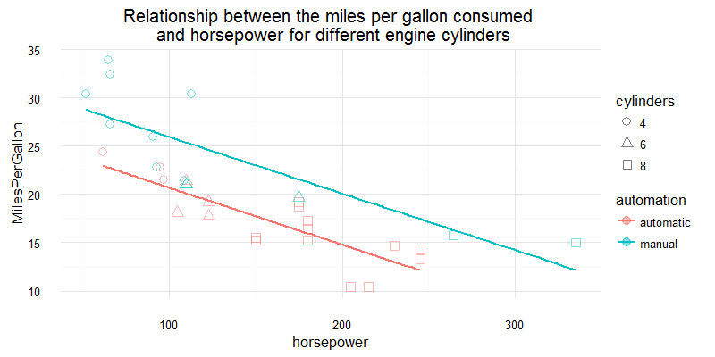

---
title       : Developing Data Products Project
subtitle    : Create a web page with Slidify or Rstudio Presenter
author      : Balogun Stephen Taiye 
job         : Data Science student
framework   : io2012        # {io2012, html5slides, shower, dzslides, ...}
highlighter : highlight.js  # {highlight.js, prettify, highlight}
hitheme     : tomorrow      # 
widgets     : [bootstrap, quiz, interactive]      # {mathjax, quiz, bootstrap}
mode        : selfcontained # {standalone, draft}
knit        : slidify::knit2slides
--- .class1

## Introduction

- This is my Developing Data Product class project2 report.  
- It involves using <code>slidify</code> or <code>RStudio</code> to create an html slide containing only 5 pages.  

This presentation makes use of the `mtcars` dataset that comes with R to perform some inferences on the performance of cars. The data was extracted from the 1974 Motor Trend US magazine, and comprises fuel consumption and 10 aspects of automobile design and performance for 32 automobiles (1973-74 models).  

We will be looking at the relationship between the **miles per gallon** of fuel consumed in relation to the engine horsepower, number of cylinders and the automation of the gear (automatic or manual). 

|              |  mpg| cyl| disp|  hp| drat|    wt|  qsec| vs| am| gear| carb|
|:-------------|----:|---:|----:|---:|----:|-----:|-----:|--:|--:|----:|----:|
|Mazda RX4     | 21.0|   6|  160| 110| 3.90| 2.620| 16.46|  0|  1|    4|    4|
|Mazda RX4 Wag | 21.0|   6|  160| 110| 3.90| 2.875| 17.02|  0|  1|    4|    4|
|Datsun 710    | 22.8|   4|  108|  93| 3.85| 2.320| 18.61|  1|  1|    4|    1|

--- bg:lightgoldenrodyellow 

## Miles per Gallon vs engine Horsepower

Here, we look at the relationship between the **miles per gallon** and the engine **horsepower** only.

--- bg:powerblue

## Cylinder effect on mpg

Now that we have seen that there is a decline in the miles per gallon consumed as the horsepower of the engine increases, we look at how the number of engine cylinder affects this relationship.

--- bg:whitesmoke

## Effect of automation

Finally, we look at how the automation of the car affects this relationship between `miles per gallon` and `horsepower`.

